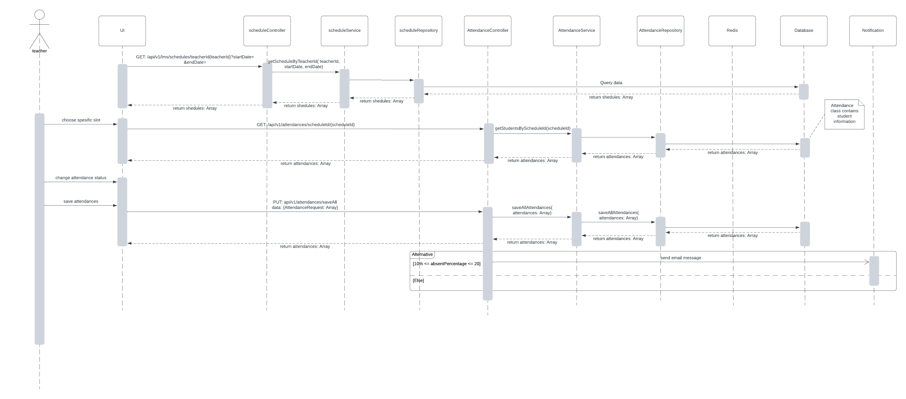
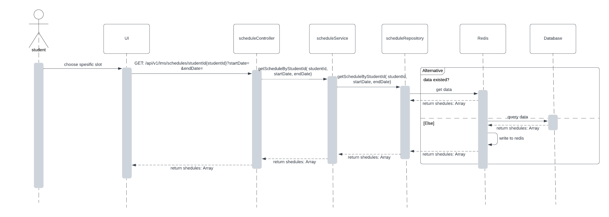

# lms_system
running demo, website running on port 5175
```
docker compose -f Docker-compose-dev.yml up -d --build 
```
## account for demo
- teacher: teacher1 - teacher1
- student: student1 - student1
- admin: admin - admin

## nexus
```
url: https://nexus-lms.azurewebsites.net/
username: admin
password: admin123
```
## Teacher


This diagram shows how teachers manage attendance and how backend services process and notify based on attendance data.

## Student


This diagram illustrates how students retrieve their schedule list